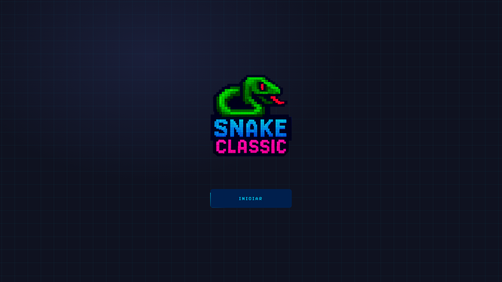
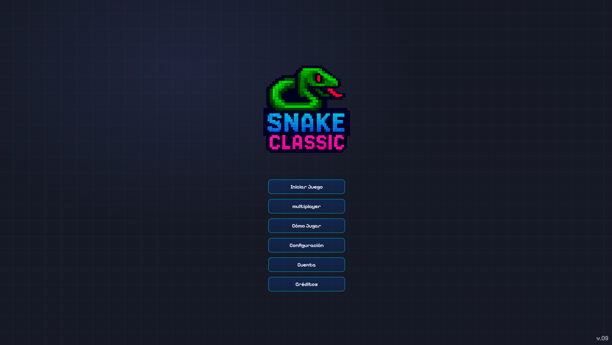
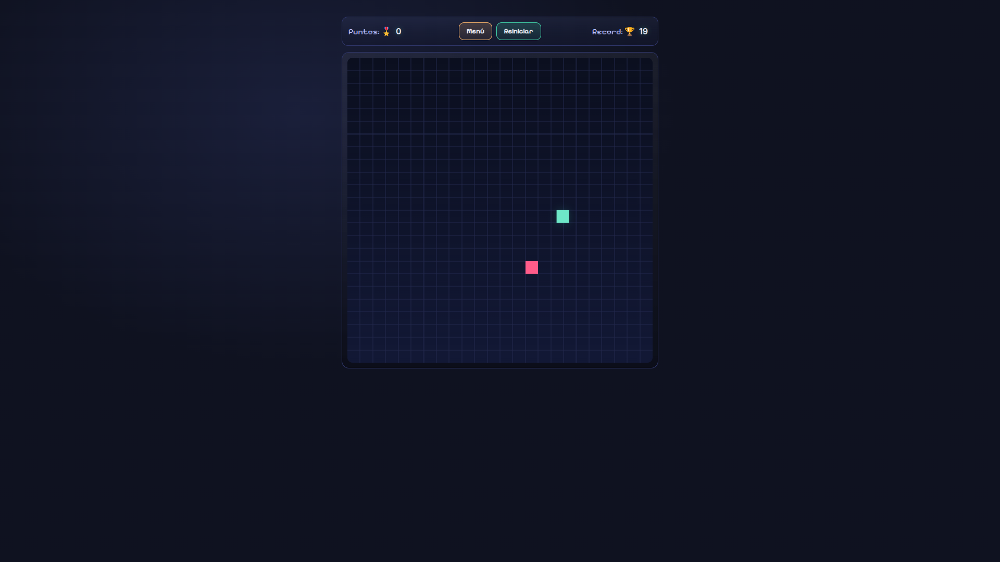
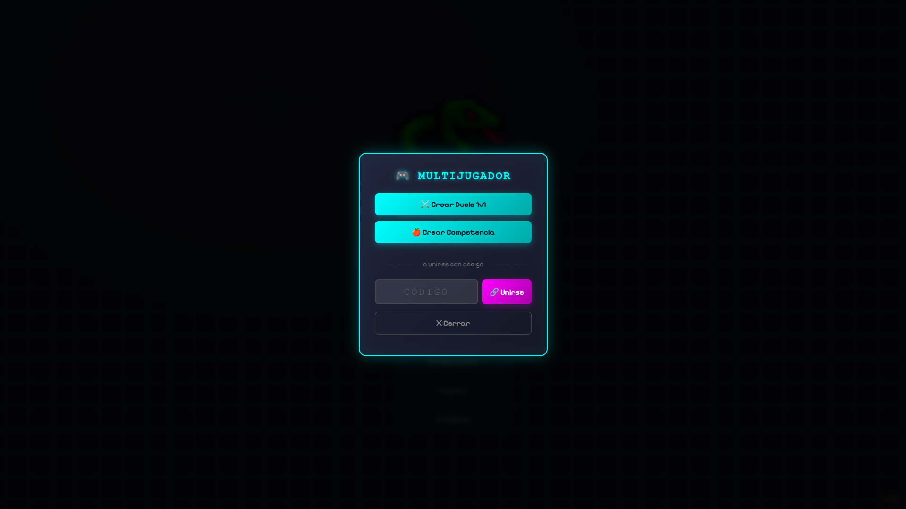
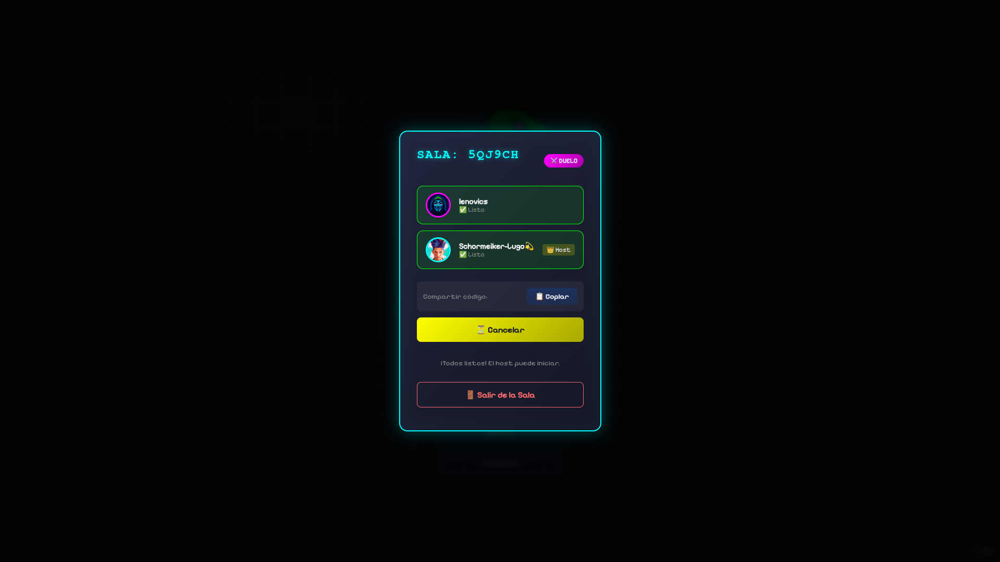

# 🐍 **Retro Snake Classic** – *The pixel‑perfect nostalgia machine!*

> ¡Qué tal, amigo!  
> Este proyecto es mi propio *Snake Classic*, un juego retro que he estado desarrollando con mucho cariño y una pizca de magia JavaScript.  
> Si te gusta el estilo 8‑bits y el desafío sin fin de los serpientes comestibles, **¡este README está hecho para ti!**  
> ¡Vamos a sumergirnos en la historia, las tecnologías, la jugabilidad y cómo puedes contribuir a la evolución de este clásico!

---

## 🎮 ¿Qué es Retro Snake Classic?

Retro Snake Classic es una versión moderna del icónico juego **Snake** que muchos recuerdan de las cajitas de videojuegos de los 90. La experiencia está construida con:

- **HTML5 Canvas** (para gráficos en 2‑D pixelados)
- **CSS3** (variables para colores y sombras)
- **JavaScript ES6+** (manejo modular, eventos, audio)
- **Web Audio API** (sonidos de bite, beep y efectos especiales)
- **Responsive design** (compatible con móvil y escritorio)

¡El objetivo sigue siendo el mismo: controla la serpiente, come comida, crece más rápido y evita chocar contra las paredes o tu propio cuerpo! 🎯

---

## 📸 **Captura de pantalla (demo)**

> *¡Mira cómo la serpiente se desliza suavemente y brilla con luces sutiles mientras avanza!*

---

## 📦 Como jugar ?

> **Todo lo que necesitas**: ingrea a la web y diviertete como nunca: 
> https://schormeikerlugo.github.io/Snake-Classic/

---

## 🛠️ **Estructura del proyecto**

| 📁 Carpeta / Archivo | 🧾 Descripción |
|---|---|
| `index.html` | 🚀 Punto de entrada HTML que carga todo el juego. |
| `js/` | 📁 Carpeta principal que contiene todo el código fuente de JavaScript. |
| `js/main.js` | 🏁 Punto de entrada principal de la aplicación. Inicializa el juego y el menú. |
| `js/config/` | ⚙️ Módulo de configuración. |
| `js/config/constants.js` | 📏 Define las constantes globales del juego (lienzo, elementos del DOM, etc.). |
| `js/config/colors.js` | 🎨 Gestiona la paleta de colores y la lógica de cambio de color de la serpiente. |
| `js/core/` | 🧠 Núcleo del juego. |
| `js/core/game.js` | 🎮 Clase principal del juego, encapsula el estado y la lógica principal. |
| `js/core/gameLogic.js` | 🕹️ Contiene la lógica de movimiento, colisiones, puntuación y estado del juego. |
| `js/core/rendering.js` | 🖼️ Funciones responsables de dibujar todos los elementos en el lienzo. |
| `js/ui/` | 🖥️ Módulo de interfaz de usuario. |
| `js/ui/menu.js` | 📜 Gestiona la lógica de los botones y la navegación del menú principal. |
| `js/ui/modal.js` | 💬 Controla la visualización y el comportamiento de los modales. |
| `js/ui/ui.js` | ✨ Funciones de utilidad para gestionar la visibilidad de los componentes de la interfaz. |
| `js/ui/mobile-views.js`| 📱 Gestiona la lógica para alternar entre las vistas de escritorio y móvil para el chat y el ranking. |
| `js/ui/update.js` | 🔄 Gestiona la lógica de actualización del Service Worker. |
| `js/features/` | 🧩 Módulo de características adicionales. |
| `js/features/auth.js` | 👤 Gestiona la autenticación de usuarios (registro, inicio de sesión). |
| `js/features/chat.js` | 💬 Implementa la funcionalidad de chat en tiempo real. |
| `js/features/ranking.js` | 🏆 Gestiona la tabla de clasificación de puntajes. |
| `js/features/settings.js`| 🔧 Define la configuración del juego (sonido, volumen). |
| `js/sound/` | 🎵 Módulo de sonido. |
| `js/sound/audio.js` | 🔊 Gestiona la reproducción de la música de fondo. |
| `js/sound/sfx.js` | 🎶 Gestiona la reproducción de efectos de sonido. |
| `js/lib/` | 📚 Módulo de librerías de terceros. |
| `js/lib/supabaseClient.js`| ☁️ Cliente de Supabase para la interacción con el backend. |
| `js/utils/` | 🛠️ Módulo de utilidades. |
| `js/utils/utils.js` | 🔨 Funciones de ayuda reutilizables en todo el proyecto. |
| `styles/` | 🎨 Carpeta que contiene todos los archivos de estilo CSS. |
| `assets/` | 🖼️ Carpeta que contiene todos los recursos (imágenes, audio, fuentes). |

---

### 🎨 Estilo visual sugerido
- **Pixelart + Cyberpunk**: tipografías monoespaciadas, colores neón (#00FFFF, #FF00FF), bordes tipo CRT.
- **Microinteracciones**: animaciones sutiles en hover para botones y puntajes.
- **Modularidad visual**: cada componente puede tener su propio tema (ej. audio = ondas, bestscore = medallas).

## 📔 Nota:
 Cada módulo exporta/consume funciones y constantes de manera clara y reutilizable, facilitando la adición de nuevas características. 

---

 ## 🎮 Cómo jugar 

| 🕹️ Acción             | ⌨️ Control                                     |
|------------------------|-----------------------------------------------|
| Mover la serpiente     | Flechas ↔️ ↕️ &nbsp; *o* &nbsp; W, A, S, D    |
| Pausar / Reanudar      | Barra espaciadora                             |
| Reiniciar              | Boton de reinicio                             |
| Volver al menú         | Boton de menu                                 |

## 📔 Nota
¡El juego es completamente responsive, así que el mismo teclado o pantalla táctil funciona en cualquier dispositivo! 

---

## 🌟 Características especiales

- 🎞️ **Interpolación**: Movimiento suave de la serpiente con `requestAnimationFrame`.
- 🎨 **Colores Dinámicos de la Serpiente**: La serpiente cambia de color cada 10 puntos, con resplandor adaptativo.
- 🚀 **Rendimiento Optimizado**: Mejoras significativas en la fluidez del juego en móviles, especialmente al comer.
- 🕹️ **Controles Móviles Mejorados**: Área táctil circular precisa y posicionamiento responsivo de botones de pausa/reinicio.
- 🎶 **Sistema de Audio Avanzado**: Nuevos efectos de sonido para eventos clave (comer, bonus, pausa, game over, modales) y control de volumen maestro.
- 🔊 **Atenuación de Música**: La música de fondo se atenúa suavemente para destacar sonidos importantes como el bonus.
- 🛑 **Game‑Over Overlay**: Animación tipo *scanner* que se despliega al chocar.
- 🏆 **Best Score**: Guardado en `localStorage` con persistencia y visualización clara.
- 📱 **Móvil Friendly**: Gestos táctiles y controles WASD funcionan igual que en PC.
- 📊 **Pantalla de Puntuaciones**: Interfaz clara con el mejor puntaje y botón `Reset`.

---

## ✨ Novedades y Mejoras Recientes

Aquí un resumen de las últimas actualizaciones que hemos implementado para enriquecer la experiencia de juego:

- **Confirmación de Reinicio de Partida:**
    - Se ha añadido un modal de confirmación que aparece al intentar reiniciar una partida en curso, previniendo la pérdida de progreso por clics accidentales. El juego se pausa mientras el modal está visible.
- **Mejoras en la Experiencia Móvil:**
    - **Modal de Créditos:** Corregido el desbordamiento en pantallas pequeñas; ahora es desplazable.
    - **Área Táctil de Botones:** Ampliada el área de pulsación de los controles de dirección para mejorar la jugabilidad.
    - **Espaciado de Controles:** Aumentado el espacio vertical entre los botones para evitar toques accidentales.
- **Compatibilidad PWA (Android):**
    - Se ha fijado la orientación a vertical en el `manifest.json` para asegurar una correcta visualización en pantalla completa.

- **Cambio de Color Dinámico de la Serpiente y Resplandor:**
    - La serpiente ahora cambia de color cada 10 puntos, ciclando a través de una paleta de colores definida.
    - El efecto de resplandor (glow) de la serpiente también se adapta al color actual.
- **Optimización de Rendimiento en Móviles:**
    - Se refactorizó la lógica de renderizado para cachear los valores de color, evitando lecturas costosas del DOM en cada fotograma y mejorando la fluidez del juego en dispositivos móviles.
- **Mejoras en los Controles Móviles:**
    - **Área Táctil Circular:** Se corrigió el problema donde tocar las esquinas de los botones de dirección activaba el hover pero no la acción, haciendo que el área de clic sea perfectamente circular.
    - **Posicionamiento Responsivo:** Los botones de pausa y reinicio móviles ahora se posicionan de forma responsiva, alineándose correctamente debajo del lienzo del juego y a los lados del botón de dirección "arriba".
    - **Estilos de Hover Consistentes:** Se restauraron y ajustaron los efectos de hover para los botones de dirección, pausa y reinicio móviles, asegurando que el texto se mantenga blanco y los resplandores sean los correctos (azul brillante para dirección, morado para pausa, verde para reiniciar).
- **Integración de Nuevos Efectos de Sonido:**
    - Se implementó un sistema de gestión de efectos de sonido (`sfx.js`) para reproducir sonidos específicos en eventos clave del juego:
        - `comer.wav`: Al comer comida (excepto cada 10 puntos).
        - `bonus.wav`: Cada 10 puntos (cuando la serpiente cambia de color).
        - `pausa.ogg`: Al pausar el juego.
        - `game-over.wav`: Al perder la partida.
        - `abrir-modal.ogg` y `cerrar-modal.ogg`: Al abrir y cerrar modales.
    - Se eliminaron los sonidos de "beep" antiguos.
- **Control de Volumen Maestro:**
    - Se añadió un deslizador de volumen en el menú de configuración para controlar el volumen general de la música y los efectos de sonido.
    - El volumen maestro se guarda en `localStorage`.
- **Atenuación de Música de Fondo para Sonido de Bonus:**
    - La música de fondo ahora se atenúa suavemente al 60% cuando se reproduce el sonido de "bonus" (cada 10 puntos), y luego vuelve a su volumen normal de forma gradual.
- **Actualización de la Sección de Créditos:**
    - Se actualizó el contenido del modal de créditos con la información detallada proporcionada.
    - Se añadió una imagen de avatar circular en la parte superior de la sección de créditos.

---

## 🎯 Roadmap – Futuras mejoras

## 🧠 Roadmap de Features

Cada idea está organizada por estado, tipo de mejora y detalles técnicos. Este formato facilita la colaboración, el seguimiento y la expansión del universo Snake Classic.

| 🧩 Feature                  | 📌 Estado         | 🧪 Tipo de Mejora     | ⚙️ Detalles Técnicos                                                                 |
|----------------------------|------------------|-----------------------|--------------------------------------------------------------------------------------|
| Modo Obstáculos            | ✅ Propuesta      | Jugabilidad           | Paredes internas que aumentan la dificultad progresivamente.                        |
| Power‑Ups                  | 🧪 En pruebas      | Mecánicas             | Ralentizar, duplicar puntos, invulnerabilidad temporal.                             |
| Modo multijugador          | 🔄 En prototipo   | Jugabilidad avanzada  | Dos serpientes compiten por la misma comida. Requiere sincronización de inputs.     |
| Leaderboard online         | 🌐 En exploración | Backend / Persistencia| Integración con Firebase o backend modular para puntajes globales persistentes.     |

## 📔 Nota
Estas ideas están abiertas para que los implementes o sugieras en Issues! 🎯

---

## 🤝 Cómo contribuir

1️⃣ Fork este repositorio y crea tu rama (git checkout -b feature-nueva-serpiente).
2️⃣ Haz los cambios y confirma tus commits con mensajes claros (feat: agregar modo multijugador).
3️⃣ Abre un Pull Request con una descripción detallada.
4️⃣ ¡El mantenedor revisará tu contribución lo antes posible! 🚀

🪙  Si te gustó este proyecto y quieres apoyar su evolución, puedes hacer una donación para ayudarme a seguir desarrollando nuevas variantes visuales, efectos pixelart, microinteracciones y compatibilidad avanzada con entornos Linux. Cada aporte impulsa la creación de experiencias más pulidas, modulares y accesibles para todos. ¡Gracias por ser parte de esta misión retro-futurista! 💜

Bitcoin : bc1qngxlgsz3tj6v9kkgumv0fnrf7fsfn9wjesjghr
USDT (TRON): TL3Vwuyf1iA86nB6vzXiNbtgdYBrWLxEEi

## 📜 Términos y Condiciones de Uso – Snake Classic

Al descargar, ejecutar o modificar este juego, aceptas los siguientes términos:

### 1. 📦 Uso Personal y Educativo
Este proyecto está disponible para fines personales, educativos y de aprendizaje. Puedes jugarlo, estudiarlo y modificarlo para mejorar tus habilidades técnicas o creativas.

### 2. 🚫 Uso Comercial
No está permitido distribuir, vender o monetizar este juego (ni sus variantes) sin autorización expresa del autor. Si deseas incluirlo en un producto comercial, contáctame previamente.

### 3. 🧠 Propiedad Intelectual
Todos los assets visuales, efectos de sonido, animaciones y código original están protegidos por derechos de autor. Las contribuciones externas están acreditadas en la sección de colaboradores.

### 4. 🔧 Modificaciones
Puedes modificar el código para uso personal o educativo. Si publicas una variante, se recomienda incluir créditos al autor original y especificar los cambios realizados.

### 5. 🐞 Responsabilidad
Este juego se ofrece "tal cual", sin garantías. No me hago responsable por daños, pérdidas o conflictos derivados del uso del software.

### 6. 🤝 Colaboraciones
Si deseas contribuir con mejoras, assets, traducciones o nuevas mecánicas, eres bienvenido. Revisa el roadmap y abre un issue o pull request con tu propuesta.

© 2025 Retro Snake Classic.

**Gracias por apoyar este proyecto retro-futurista. Tu respeto por estos términos permite que siga creciendo y evolucionando.**

---

## 🤝 Contribuyentes

| 👤 Contribuyente            | 🧰 Rol                                                                 |
|----------------------|------------------------------------------------------------------------|
| **Schormeiker Lugo**        | 🧠 Desarrollo principal, 🎨 diseño de UI/UX, 🧩 arquitectura modular.  |
| **Free Music - Lifeformed.**| 🔊 Audio y efectos de sonido.                                          |
| **Gemini CLI**              | 🤖 Asistencia en desarrollo, refactorización y nuevas características. |

---

## 📬 Soporte y dudas

Si tienes alguna pregunta, problema o sugerencia, abre un issue y lo revisaremos lo antes posible.

¡No dudes en proponer mejoras, reportar bugs o compartir ideas frescas!

## 🙏 Agradecimientos

. Inspiración retro: Gracias a los viejos cartuchos de Atari y Nintendo que nos enseñaron a amar el pixel‑art.
. Frameworks de la comunidad: HTML5 Canvas, CSS3 y JavaScript por la robustez y flexibilidad.
. Todos los testers que se atrevieron a romper la serpiente.

## 🚀 ¡Listo para jugar y hacer historia juntos?

Abraza el desafío, comparte el juego y haz crecer este clásico.
¡Nos vemos en el tablero! 👋
