# 🐍 **Retro Snake Classic** – *The pixel‑perfect nostalgia machine!*

> ¡Qué tal, amigo!  
> Este proyecto es mi propio *Snake Classic*, un juego retro que he estado desarrollando con mucho cariño y una pizca de magia JavaScript.  
> Si te gusta el estilo 8‑bits y el desafío sin fin de los serpientes comestibles, **¡este README está hecho para ti!**  
> ¡Vamos a sumergirnos en la historia, las tecnologías, la jugabilidad y cómo puedes contribuir a la evolución de este clásico!

---

## 🎮 ¿Qué es Retro Snake Classic?

Retro Snake Classic es una versión moderna del icónico juego **Snake** que muchos recuerdan de las cajitas de videojuegos de los 90. La experiencia está construida con:

- **HTML5 Canvas** (para gráficos en 2‑D pixelados)
- **CSS3** (variables para colores y sombras)
- **JavaScript ES6+** (manejo modular, eventos, audio)
- **Web Audio API** (sonidos de bite, beep y efectos especiales)
- **Supabase** (autenticación, base de datos y realtime para multijugador)
- **Responsive design** (compatible con móvil y escritorio)
- **PWA** (instalable en iOS y Android como app nativa)

¡El objetivo sigue siendo el mismo: controla la serpiente, come comida, crece más rápido y evita chocar contra las paredes o tu propio cuerpo! 🎯

---

## 📸 Recorrido por la App

### Menú y Navegación

| | | |
|:---:|:---:|:---:|
| 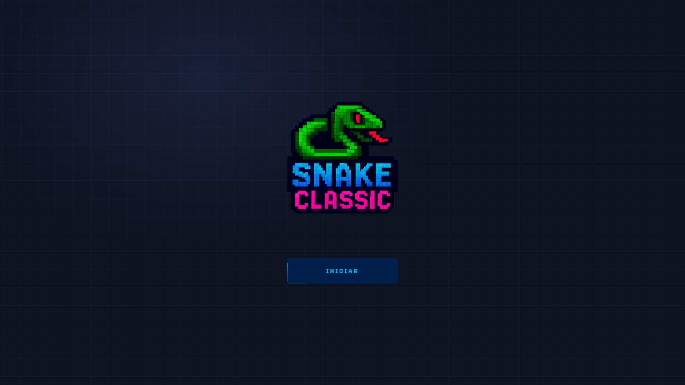 | 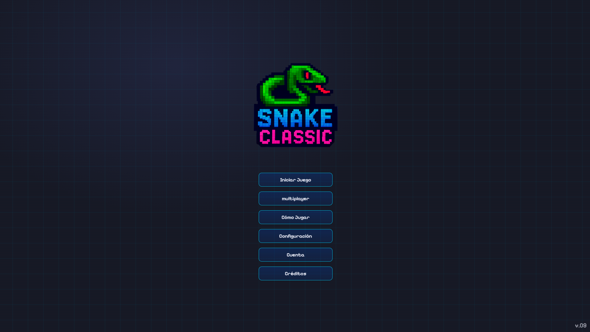 | 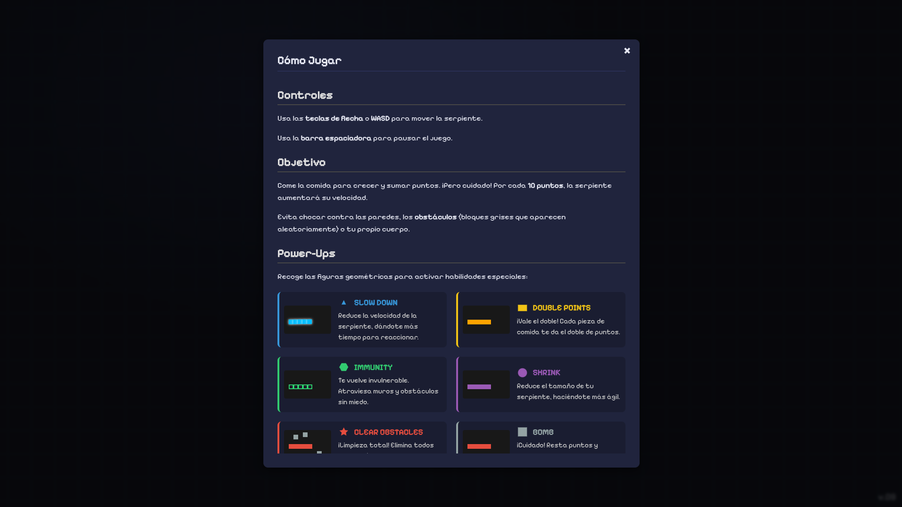 |
| Splash Screen | Menú Principal | Cómo Jugar |
| 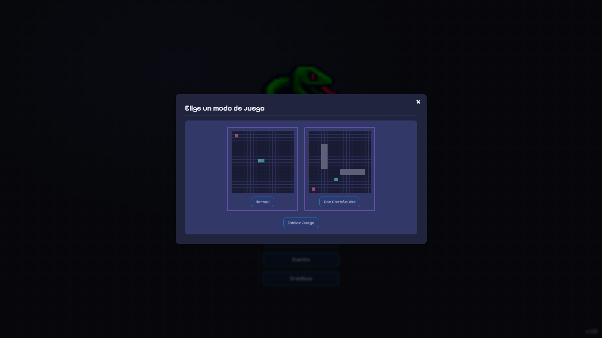 | 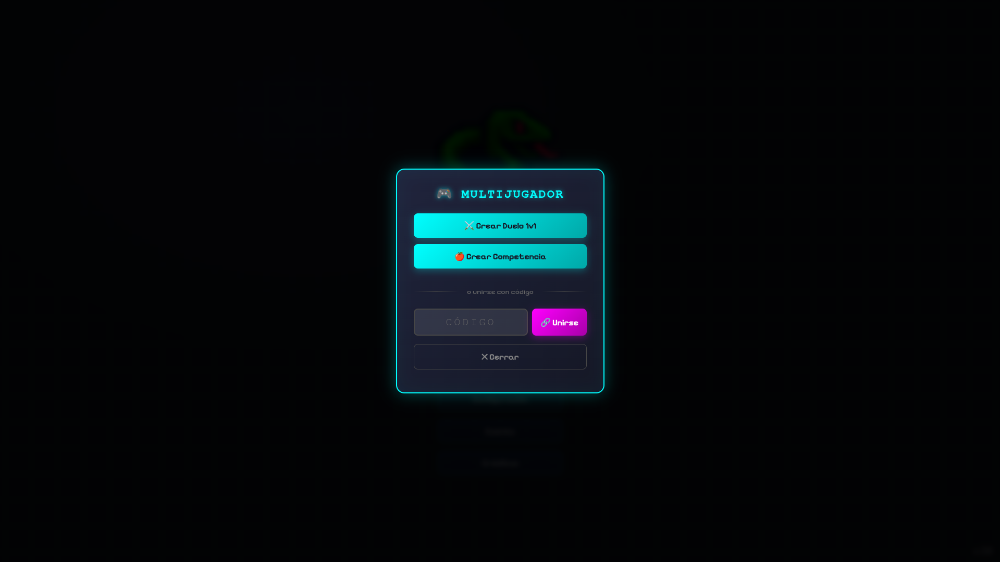 | 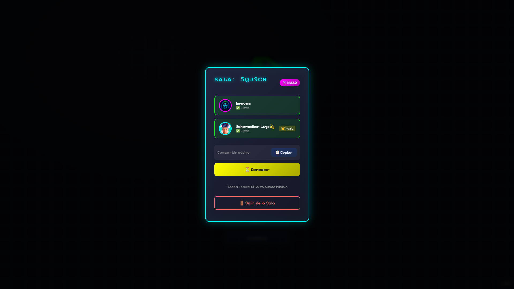 |
| Modo de Juego | Multiplayer | Lobby |
| 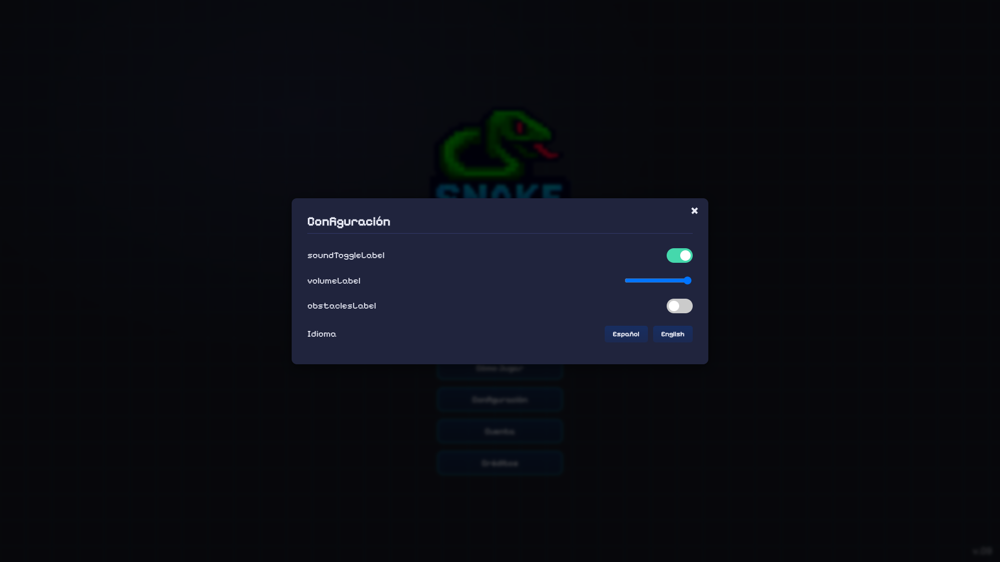 | 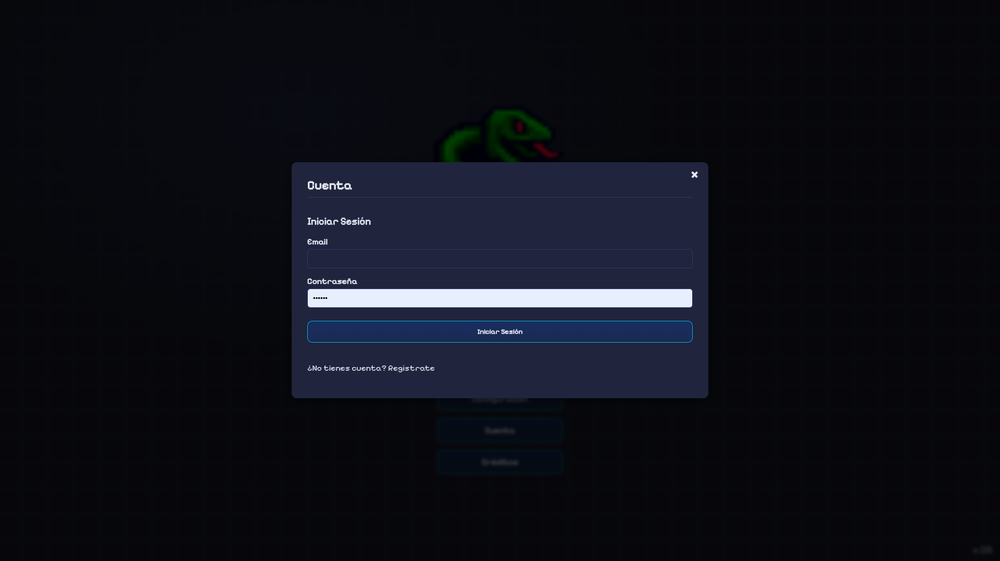 | 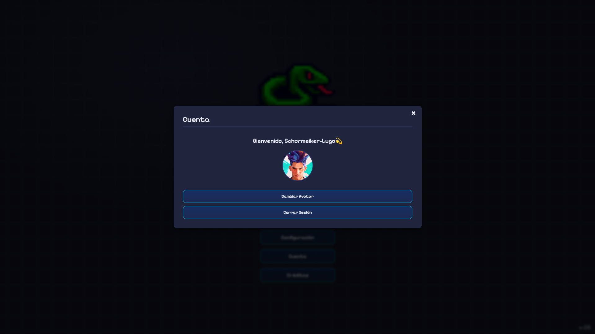 |
| Configuración | Login | Perfil |
| 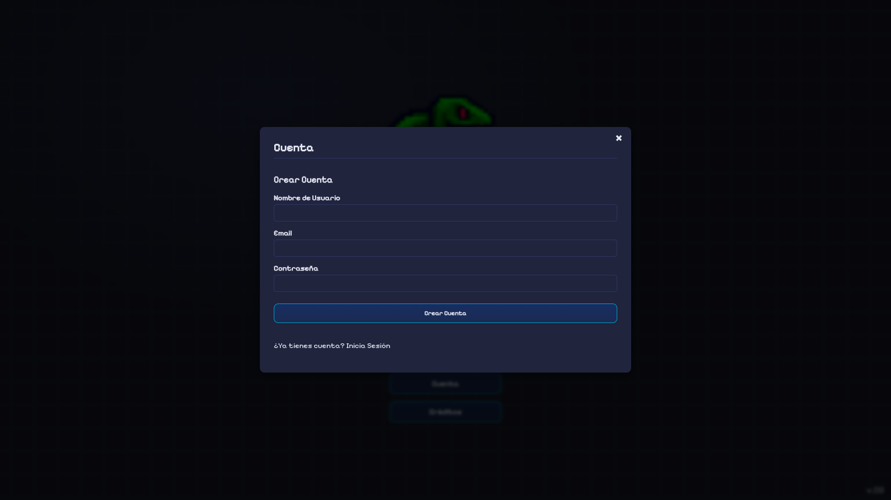 | 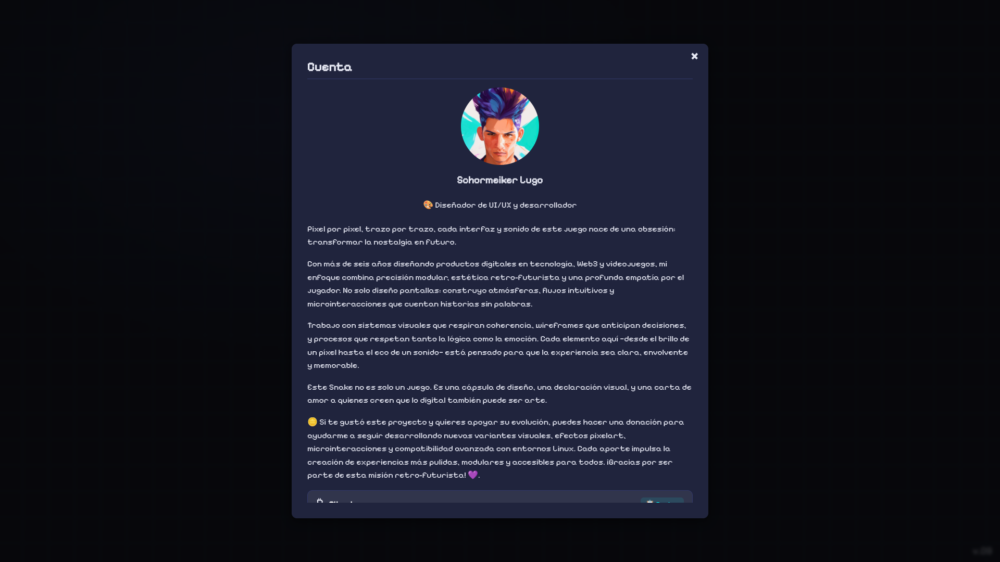 | |
| Registro | Créditos | |

### Modos de Juego

| | | |
|:---:|:---:|:---:|
| 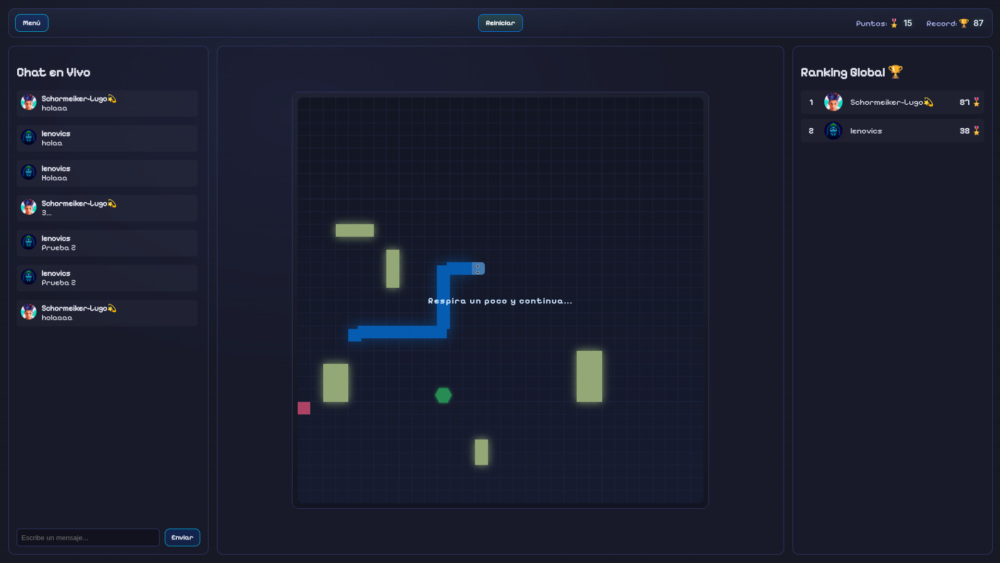 | 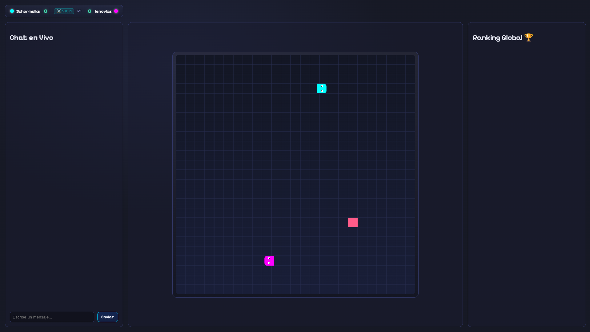 | 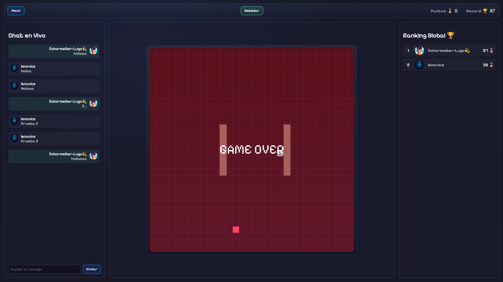 |
| Modo Single Player | Duelo 1v1 | Game Over |
| 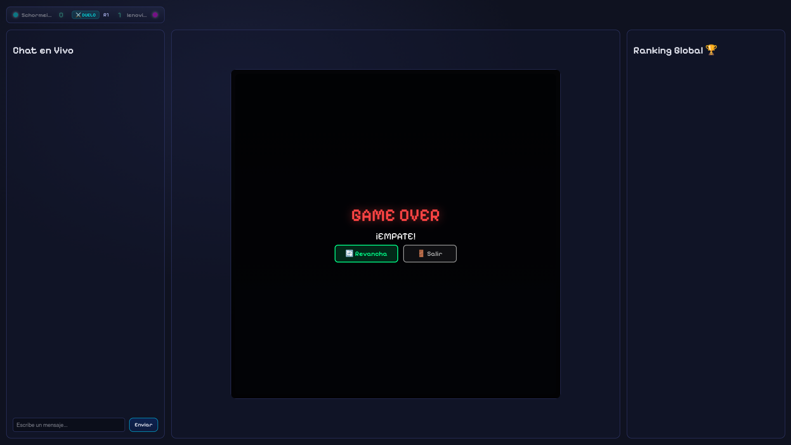 | | |
| Game Over Multiplayer | | |

---

## 📦 Cómo jugar

> **Todo lo que necesitas**: ingresa a la web y diviértete como nunca:  
> https://schormeikerlugo.github.io/Snake-Classic/

---

## 🎮 Controles

| 🕹️ Acción             | ⌨️ Control                                     |
|------------------------|-----------------------------------------------|
| Mover la serpiente     | Flechas ↔️ ↕️ &nbsp; *o* &nbsp; W, A, S, D    |
| Pausar / Reanudar      | Barra espaciadora                             |
| Reiniciar              | Botón de reinicio                             |
| Volver al menú         | Botón de menú                                 |
| **Multijugador**       | **Mismas teclas** + **ESC** (salir) + **ESPACIO** (revancha)|

---

## 🌐 **Multijugador**

¡Juega en tiempo real con amigos en la misma red o por internet!

### Modos de Juego:
1. **⚔️ Duelo 1v1**: 
   - Objetivo: Sobrevivir más tiempo que el oponente.
   - Colisiones activas entre serpientes.
   
2. **🏆 Competencia por Puntos**: 
   - Objetivo: Obtener más puntos en 2 minutos.
   - **Ghost Mode**: Las serpientes pueden atravesarse entre sí.
   - **Comida Compartida**: Sincronizada en tiempo real.
   - **Timer**: Cuenta regresiva con alerta sonora.

### Características:
- **Salas Privadas**: Crea una sala y comparte el código de 6 caracteres.
- **Chat de Sala**: Mensajes rápidos y efímeros.
- **HUD en Tiempo Real**: Scores, victorias y timer visibles durante la partida.
- **Sistema de Revancha**: Botones para pedir revancha al terminar.
- **Notificaciones**: Toasts informativos cuando un jugador se une o abandona.
- **Sincronización Total**: Movimientos, puntuación y eventos sincronizados.

> **Nota**: Requiere conexión a internet y una cuenta registrada.

---

## 🌟 Características especiales

- 🎞️ **Interpolación**: Movimiento suave de la serpiente con `requestAnimationFrame`.
- 🎨 **Colores Dinámicos**: La serpiente cambia de color cada 10 puntos, con resplandor adaptativo.
- 🚀 **Rendimiento Optimizado**: Fluidez en móviles y escritorio.
- 🕹️ **Controles Móviles**: D-pad táctil circular preciso y responsive.
- 🎶 **Sistema de Audio**: Efectos de sonido para comer, bonus, pausa, game over y modales.
- 🔊 **Atenuación de Música**: La música se atenúa para destacar eventos importantes.
- 📳 **Feedback Háptico**: Vibración en dispositivos Android al comer, morir y activar power-ups.
- 🛑 **Game‑Over Overlay**: Pantalla HTML con botones reales de revancha y salir.
- 🏆 **Ranking Global**: Tabla de clasificación persistente con avatares.
- 📱 **PWA**: Instalable como app en iOS y Android, con splash screen y pantalla completa.

### ✨ Power-Ups

| Power-Up | Forma | Color | Efecto | Duración |
| :--- | :--- | :--- | :--- | :--- |
| **Ralentizar** | Triángulo | Azul | Reduce la velocidad de la serpiente. | 10 seg |
| **Puntos Dobles** | Cuadrilátero | Amarillo | Duplica los puntos por comida. | 15 seg |
| **Inmunidad** | Hexágono | Verde | Inmune a choques contra paredes y obstáculos. | 10 seg |
| **Encoger** | Círculo | Morado | Reduce el tamaño de la serpiente. | Instantáneo |
| **Limpiar Obstáculos** | Estrella | Rojo | Elimina todos los obstáculos del tablero. | Instantáneo |
| **Bomba** | Cuadrado | Gris | Resta puntos y reubica la comida. | Instantáneo |

---

## 🛠️ **Estructura del proyecto**

| 📁 Carpeta / Archivo | 🧾 Descripción |
|---|---|
| `index.html` | 🚀 Punto de entrada HTML. |
| `js/config/` | ⚙️ Constantes, colores y power-ups. |
| `js/core/` | 🧠 Game loop, lógica de juego, rendering y colisiones. |
| `js/features/` | 🧩 Auth, chat, ranking, settings. |
| `js/features/multiplayer/` | 🎮 Salas, sincronización, UI del lobby. |
| `js/features/multiplayer/game/` | 🕹️ Game loop multiplayer, HUD, game over, rematch. |
| `js/ui/` | 🖥️ Menú, modales, vistas móviles. |
| `js/sound/` | 🎵 Música y efectos de sonido. |
| `js/utils/` | 🛠️ Utilidades, haptics, idiomas. |
| `js/lib/` | ☁️ Cliente de Supabase. |
| `styles/` | 🎨 CSS modular (variables, game, modal, multiplayer, controles). |
| `supabase/migrations/` | 🗄️ Esquema de base de datos y políticas RLS. |
| `assets/` | 🖼️ Imágenes, audio, fuentes, traducciones. |
| `scripts/` | 📜 Start, stop y tunnel para desarrollo. |

---

## 🎯 Roadmap

| 🧩 Feature                  | 📌 Estado         | 🧪 Tipo              |
|----------------------------|------------------|-----------------------|
| Modo Obstáculos            | ✅ Implementado   | Jugabilidad           |
| Power‑Ups                  | ✅ Implementado   | Mecánicas             |
| Multijugador 1v1           | ✅ Implementado   | Jugabilidad avanzada  |
| Competencia por Puntos     | ✅ Implementado   | Jugabilidad avanzada  |
| Chat en tiempo real        | ✅ Implementado   | Social                |
| Ranking global             | ✅ Implementado   | Backend               |
| PWA (iOS/Android)          | ✅ Implementado   | Distribución          |
| HUD HTML Multiplayer       | ✅ Implementado   | UX                    |
| Feedback háptico           | ✅ Implementado   | UX móvil              |
| Sistema de toasts          | ✅ Implementado   | UX                    |
| App nativa (Capacitor)     | 🔄 Planeado       | Distribución          |
| Matchmaking automático     | 🌐 En exploración | Jugabilidad           |

---

## 🤝 Cómo contribuir

1. Fork este repositorio y crea tu rama (`git checkout -b feature-nueva-serpiente`).
2. Haz los cambios y confirma tus commits con mensajes claros (`feat: agregar modo multijugador`).
3. Abre un Pull Request con una descripción detallada.
4. ¡El mantenedor revisará tu contribución lo antes posible! 🚀

### 🪙 Apoya el proyecto

Si te gustó este proyecto y quieres apoyar su evolución, puedes hacer una donación:

| Red | Dirección |
|-----|-----------|
| **Bitcoin** | `bc1qngxlgsz3tj6v9kkgumv0fnrf7fsfn9wjesjghr` |
| **USDT (TRON)** | `TL3Vwuyf1iA86nB6vzXiNbtgdYBrWLxEEi` |

---

## 📜 Términos y Condiciones de Uso

Al descargar, ejecutar o modificar este juego, aceptas los siguientes términos:

1. **Uso Personal y Educativo** — Disponible para fines personales, educativos y de aprendizaje.
2. **Uso Comercial** — No está permitido sin autorización expresa del autor.
3. **Propiedad Intelectual** — Assets visuales, sonidos, animaciones y código están protegidos por derechos de autor.
4. **Modificaciones** — Puedes modificar para uso personal. Si publicas una variante, incluye créditos al autor original.
5. **Responsabilidad** — El juego se ofrece "tal cual", sin garantías.
6. **Colaboraciones** — Bienvenidas vía Issues o Pull Requests.

© 2025 Retro Snake Classic.

---

## 🤝 Contribuyentes

| 👤 Contribuyente            | 🧰 Rol                                                                 |
|----------------------|------------------------------------------------------------------------|
| **Schormeiker Lugo**        | 🧠 Desarrollo principal, 🎨 diseño de UI/UX, 🧩 arquitectura modular.  |
| **Free Music - Lifeformed.**| 🔊 Audio y efectos de sonido.                                          |

---

## 📬 Soporte

Si tienes alguna pregunta, problema o sugerencia, abre un issue y lo revisaremos lo antes posible.

## 🙏 Agradecimientos

- Inspiración retro: Gracias a los viejos cartuchos de Atari y Nintendo que nos enseñaron a amar el pixel‑art.
- HTML5 Canvas, CSS3 y JavaScript por la robustez y flexibilidad.
- Todos los testers que se atrevieron a romper la serpiente.

## 🚀 ¡Listo para jugar y hacer historia juntos!

Abraza el desafío, comparte el juego y haz crecer este clásico.
¡Nos vemos en el tablero! 👋
