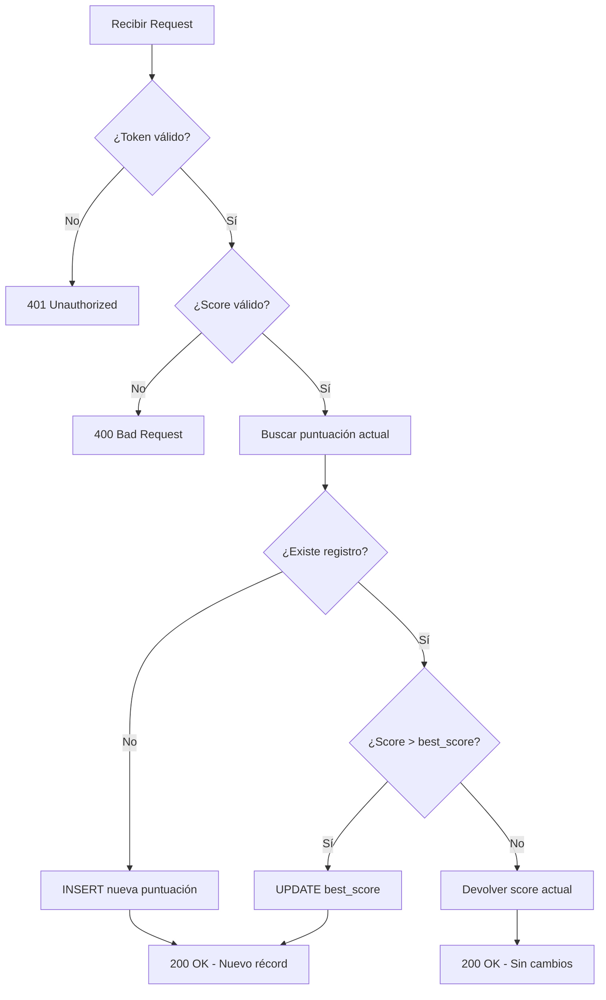

# ⚡ Edge Functions

Documentación de las funciones serverless de Supabase.

---

## 📍 URL Base

```
http://127.0.0.1:54331/functions/v1/
```

---

## 🎯 `update-score`

Valida y actualiza la puntuación del jugador.

### Endpoint
```
POST /functions/v1/update-score
```

### Headers
```http
Authorization: Bearer {user_jwt_token}
Content-Type: application/json
```

### Request Body
```json
{
  "score": 150
}
```

### Respuestas

#### ✅ Éxito (200)
```json
{
  "success": true,
  "isNewRecord": true,
  "score": 150,
  "message": "¡Nuevo récord!"
}
```

#### ✅ Sin nuevo récord (200)
```json
{
  "success": true,
  "isNewRecord": false,
  "score": 100,
  "message": "Puntuación guardada"
}
```

#### ❌ No autorizado (401)
```json
{
  "error": "No authorization header"
}
```

#### ❌ Puntuación inválida (400)
```json
{
  "error": "Invalid score value"
}
```

---

### Lógica de la Función



---

### Ejemplo de Uso

```javascript
// Desde el frontend
async function submitScore(score) {
  const { data: { session } } = await supabase.auth.getSession();
  
  if (!session) {
    console.log('Usuario no autenticado');
    return;
  }

  const response = await fetch(
    'http://127.0.0.1:54331/functions/v1/update-score',
    {
      method: 'POST',
      headers: {
        'Authorization': `Bearer ${session.access_token}`,
        'Content-Type': 'application/json'
      },
      body: JSON.stringify({ score })
    }
  );

  const result = await response.json();
  
  if (result.isNewRecord) {
    console.log('¡Nuevo récord!', result.score);
  }
}
```

---

## 🔒 Seguridad

| Validación | Descripción |
|------------|-------------|
| **Autenticación** | Requiere JWT válido |
| **Rango de score** | 0 - 100,000 |
| **Tipo de dato** | Debe ser número entero |
| **Ownership** | Solo puede actualizar su propio score |

---

## 🧪 Testing

```bash
# Obtener token de usuario de prueba
TOKEN=$(npx supabase functions serve 2>&1 | grep -o 'Bearer [^ ]*' | head -1)

# Probar la función
curl -X POST http://127.0.0.1:54331/functions/v1/update-score \
  -H "Authorization: Bearer $TOKEN" \
  -H "Content-Type: application/json" \
  -d '{"score": 100}'
```
