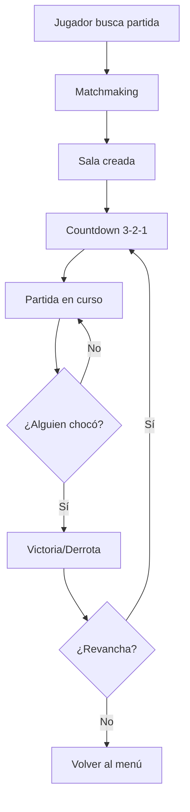
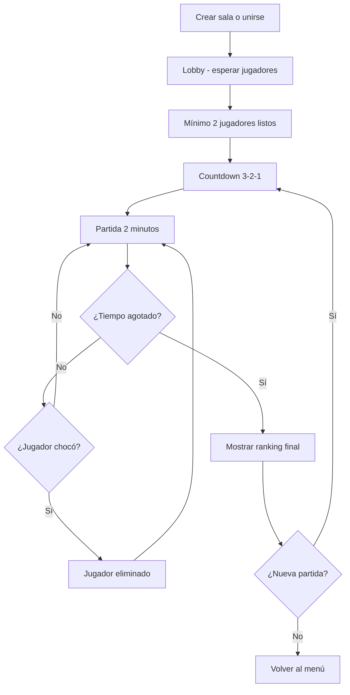

# 🎮 Modo Multijugador: Duelo 1v1 + Competencia por Puntos

## 📋 Visión General

El modo multijugador inicial combina **dos modalidades** en un mismo sistema:

| Modalidad | Jugadores | Objetivo | Duración |
|-----------|-----------|----------|----------|
| **Duelo 1v1** | 2 | Hacer que el rival choque | Hasta victoria |
| **Competencia Puntos** | 2-4 | Mayor puntuación | 2 minutos |

Ambos modos comparten la **misma infraestructura técnica**, lo que permite desarrollarlos en paralelo.

---

## 🎯 Duelo 1v1 - Diseño Detallado

### Descripción
Dos serpientes se enfrentan en una arena compacta. El objetivo es hacer que tu oponente choque contra:
- Las paredes
- Los obstáculos
- Tu cuerpo
- Su propio cuerpo

### Flujo del Juego



### Reglas del Duelo

| Regla | Descripción |
|-------|-------------|
| **Arena** | 25x25 celdas (más pequeña que single player) |
| **Spawn** | Esquinas opuestas, mirando al centro |
| **Velocidad** | Igual para ambos, incrementa cada 30s |
| **Comida** | 1-2 piezas en el mapa (opcional) |
| **Obstáculos** | Pocos o ninguno |
| **Victoria** | Cuando el oponente choca |
| **Empate** | Ambos chocan en el mismo tick |

### Mecánicas Únicas

#### 1. Colisión Cabeza-Cabeza
Si ambas cabezas ocupan la misma celda:
- **Empate** → Reiniciar ronda
- *Alternativa*: Gana quien tenga serpiente más larga

#### 2. Poder de Corte
Tu cuerpo es "sólido" para el oponente:
- Estrategia: Cortar el camino del rival
- Riesgo: Exponerte a que te corten a ti

#### 3. Sistema de Rondas (Opcional)
- Mejor de 3 o mejor de 5
- Victorias acumuladas
- Más tenso que partida única

### Interfaz de Usuario

```
┌─────────────────────────────────────────────┐
│  TÚ: serpiente_loca        RIVAL: neon_viper│
│  ███████ (7)               ████ (4)         │
├─────────────────────────────────────────────┤
│                                             │
│          ████░░░░░░░░░░░░████              │
│          █                    █              │
│          █      ARENA         █              │
│          █                    █              │
│          ████░░░░░░░░░░░░████              │
│                                             │
├─────────────────────────────────────────────┤
│  ⏱️ 1:23        RONDA 2 de 3               │
│  🏆 TÚ: 1      🏆 RIVAL: 0                  │
└─────────────────────────────────────────────┘
```

---

## 🍎 Competencia por Puntos - Diseño Detallado

### Descripción
Múltiples serpientes compiten por comer la mayor cantidad de comida en un tiempo limitado. **No hay colisiones entre serpientes**, cada una opera en su "capa".

### Flujo del Juego



### Reglas de Competencia

| Regla | Descripción |
|-------|-------------|
| **Arena** | 30x30 celdas |
| **Jugadores** | 2-4 (ideal: 4) |
| **Duración** | 2 minutos |
| **Comida** | 3-5 piezas simultáneas en el mapa |
| **Power-ups** | Sí (del modo single player) |
| **Colisiones** | Solo con paredes/obstáculos/tu cuerpo |
| **Victoria** | Mayor puntuación al final |

### Mecánicas Únicas

#### 1. Comida Compartida
- Todos ven la misma comida
- Quien la toca primero la obtiene
- Incentiva velocidad y riesgo

#### 2. Serpientes Fantasma
Las serpientes de otros jugadores son:
- ✅ Visibles (semitransparentes)
- ❌ No colisionan contigo
- Añade información visual sin frustración

#### 3. Multiplicadores de Combo
- Comer comida consecutiva rápido = bonus
- 2 comidas en <3s = ×1.5
- 3 comidas en <5s = ×2

#### 4. Comida Especial
| Tipo | Puntos | Aparición |
|------|--------|-----------|
| Normal | 1 | Siempre |
| Dorada | 3 | 20% prob |
| Arcoíris | 5 | 5% prob |

### Interfaz de Usuario

```
┌─────────────────────────────────────────────┐
│  🏆 RANKING EN VIVO          ⏱️ 1:23       │
├─────────────────────────────────────────────┤
│  1. 🔴 neon_viper      47 pts              │
│  2. 🟢 TÚ              42 pts              │
│  3. 🔵 cyber_snake     38 pts              │
│  4. 🟡 pixel_master    25 pts              │
├─────────────────────────────────────────────┤
│                                             │
│              [ARENA DE JUEGO]               │
│     Serpientes semitransparentes visibles   │
│                                             │
├─────────────────────────────────────────────┤
│  🍎×3  ⭐×1  Combo: ×1.5                   │
└─────────────────────────────────────────────┘
```

---

## 🔧 Infraestructura Técnica Compartida

### 1. Sistema de Salas (Rooms)

```typescript
interface Room {
  id: string;
  mode: 'duel' | 'points';
  host_id: string;
  players: Player[];
  status: 'waiting' | 'countdown' | 'playing' | 'finished';
  max_players: number;
  created_at: Date;
  game_state: GameState;
}

interface Player {
  id: string;
  username: string;
  avatar_url: string;
  snake: SnakeState;
  score: number;
  is_ready: boolean;
  is_alive: boolean;
}
```

### 2. Sincronización con Supabase Realtime

```javascript
// Suscribirse a cambios de la sala
const channel = supabase
  .channel(`room:${roomId}`)
  .on('broadcast', { event: 'game_state' }, (payload) => {
    updateGameState(payload.data);
  })
  .on('broadcast', { event: 'player_move' }, (payload) => {
    updatePlayerPosition(payload.player_id, payload.direction);
  })
  .subscribe();

// Enviar movimiento
channel.send({
  type: 'broadcast',
  event: 'player_move',
  payload: { player_id: myId, direction: 'up' }
});
```

### 3. Modelo de Autoridad

| Aspecto | Quién decide |
|---------|--------------|
| Posición de comida | Host de la sala |
| Colisiones | Cada cliente (optimista) |
| Victoria/Derrota | Host verifica |
| Score | Cada cliente → Host valida |

### 4. Manejo de Latencia

```
Tick del juego: 100ms
Tolerancia de lag: 200ms
Técnica: Interpolación + Predicción
```

**Predicción del cliente**:
- El jugador ve su movimiento inmediatamente
- El servidor confirma o corrige
- Otros jugadores se interpolan suavemente

### 5. Desconexión

| Escenario | Acción |
|-----------|--------|
| Jugador se desconecta | 10s para reconectar |
| Si no reconecta | Se considera derrota/eliminado |
| Host se desconecta | Migrar host al siguiente jugador |
| Todos menos 1 | Victoria automática |

---

## 🗄️ Tablas de Base de Datos

### Nueva Tabla: `salas`

```sql
CREATE TABLE salas (
  id UUID PRIMARY KEY DEFAULT gen_random_uuid(),
  code VARCHAR(6) UNIQUE NOT NULL,  -- Código para unirse
  mode VARCHAR(20) NOT NULL,         -- 'duel' o 'points'
  host_id UUID REFERENCES auth.users(id),
  status VARCHAR(20) DEFAULT 'waiting',
  max_players INTEGER DEFAULT 2,
  game_config JSONB,
  created_at TIMESTAMPTZ DEFAULT NOW(),
  started_at TIMESTAMPTZ,
  finished_at TIMESTAMPTZ
);
```

### Nueva Tabla: `partidas_multijugador`

```sql
CREATE TABLE partidas_multijugador (
  id UUID PRIMARY KEY DEFAULT gen_random_uuid(),
  sala_id UUID REFERENCES salas(id),
  mode VARCHAR(20) NOT NULL,
  duration_seconds INTEGER,
  winner_id UUID REFERENCES auth.users(id),
  created_at TIMESTAMPTZ DEFAULT NOW()
);
```

### Nueva Tabla: `resultados_partida`

```sql
CREATE TABLE resultados_partida (
  id UUID PRIMARY KEY DEFAULT gen_random_uuid(),
  partida_id UUID REFERENCES partidas_multijugador(id),
  user_id UUID REFERENCES auth.users(id),
  position INTEGER,           -- 1ro, 2do, 3ro, 4to
  score INTEGER,
  rounds_won INTEGER,         -- Para duelos
  created_at TIMESTAMPTZ DEFAULT NOW()
);
```

---

## 📱 Pantallas Nuevas

### 1. Menú Multijugador
```
┌─────────────────────────────────────────┐
│         🎮 MULTIJUGADOR                 │
├─────────────────────────────────────────┤
│                                         │
│   [🎯 CREAR SALA]                       │
│                                         │
│   [🔗 UNIRSE CON CÓDIGO]                │
│                                         │
│   [🎲 PARTIDA RÁPIDA]                   │
│                                         │
├─────────────────────────────────────────┤
│   📊 Estadísticas MP:                   │
│   Victorias: 15  Derrotas: 8            │
│   Ratio: 65%                            │
└─────────────────────────────────────────┘
```

### 2. Lobby de Sala
```
┌─────────────────────────────────────────┐
│   SALA: ABC123          Modo: Duelo 1v1 │
├─────────────────────────────────────────┤
│                                         │
│   👤 TÚ (Host)           [✅ Listo]     │
│   👤 neon_viper          [⏳ Esperando] │
│                                         │
├─────────────────────────────────────────┤
│   Compartir código: ABC123              │
│   [📋 Copiar]  [📤 Compartir]           │
├─────────────────────────────────────────┤
│            [🚀 INICIAR]                 │
└─────────────────────────────────────────┘
```

### 3. Pantalla de Victoria/Derrota
```
┌─────────────────────────────────────────┐
│                                         │
│          🏆 ¡VICTORIA!                  │
│                                         │
│        Derrotaste a: neon_viper         │
│        Duración: 1:23                   │
│        Tu longitud: 12                  │
│                                         │
│   [🔄 Revancha]  [🏠 Menú]              │
│                                         │
└─────────────────────────────────────────┘
```

---

## 📅 Roadmap de Implementación

### Fase 1: Infraestructura (1 semana)
- [ ] Crear tablas de BD (salas, partidas, resultados)
- [ ] Sistema de salas con Supabase Realtime
- [ ] Crear/unirse a sala con código
- [ ] Lobby funcional

### Fase 2: Duelo 1v1 (1-2 semanas)
- [ ] Arena multiplayer con 2 serpientes
- [ ] Sincronización de movimientos
- [ ] Detección de colisiones multi-jugador
- [ ] Sistema de victoria/derrota
- [ ] UI de duelo

### Fase 3: Competencia Puntos (1 semana)
- [ ] Modo fantasma (serpientes no colisionan)
- [ ] Sincronización de comida compartida
- [ ] Timer y ranking en vivo
- [ ] Multiplicadores de combo
- [ ] UI de competencia

### Fase 4: Polish (1 semana)
- [ ] Efectos visuales multiplayer
- [ ] Sonidos de victoria/derrota
- [ ] Estadísticas MP
- [ ] Manejo de desconexiones
- [ ] Testing y bug fixes

---

## ⏱️ Estimación Total: 4-6 semanas
